# QuickMart – E-commerce App 🛍️

A modern Flutter e-commerce app built with **Clean Architecture** and **BLoC/Cubit** state management.

## ✨ Features

- 🔐 Authentication (Email/Password, Email Verification, Forgot Password, Google Sign-In) via **Firebase**
- 🛒 Product browsing & filtering using the **DummyJSON API**
- 🔍 Search with chip-style search history (saved locally)
- ❤️ Wishlist
- 👤 Profile management (edit profile, change password, FAQs, privacy policy, terms)
- 🌍 Full localization (English & Arabic)
- 🎨 Onboarding flow
- 🌗 Light/dark theme

## 🏗️ Tech Stack

- **Architecture:** Clean Architecture (data / logic / ui layers per feature)
- **State Management:** BLoC / Cubit
- **Networking:** Dio + Retrofit
- **API:** [DummyJSON](https://dummyjson.com/)
- **Auth:** Firebase Authentication
- **Local Storage:** SharedPreferences
- **Dependency Injection:** GetIt
- **Models/States:** Freezed
- **CI/CD:** Automated build pipeline

## 🎨 UI Design

UI based on the **QuickMart – Ecommerce App UI Kit (Modern Online Shopping Experience – Next-Gen eCommerce UI)** Figma Community kit.

## 📸 Screenshots

### Onboarding & Splash

  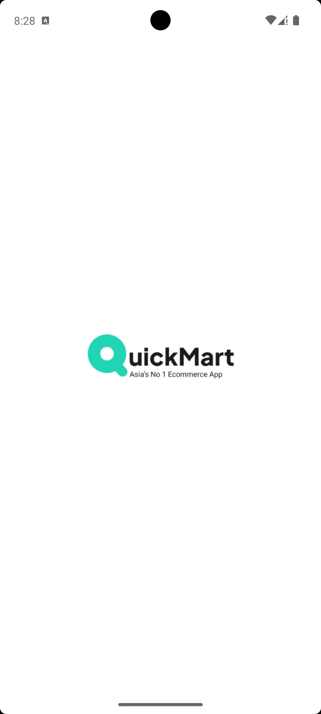
  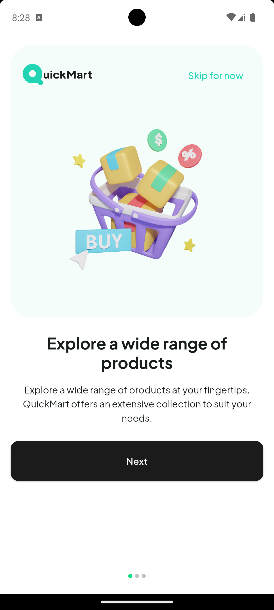
  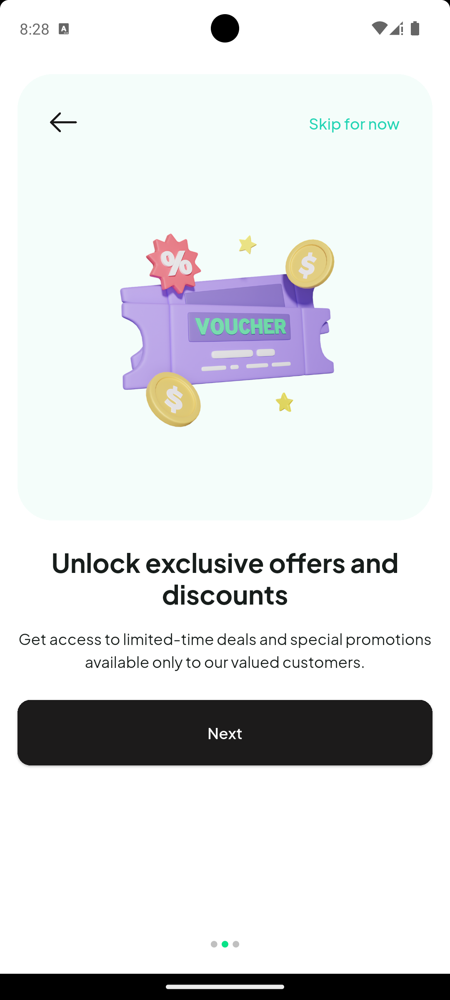
  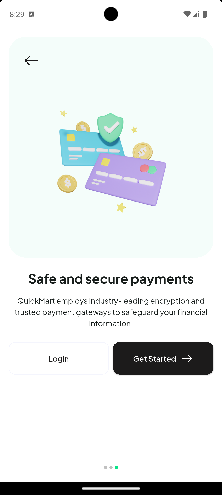

### Authentication

  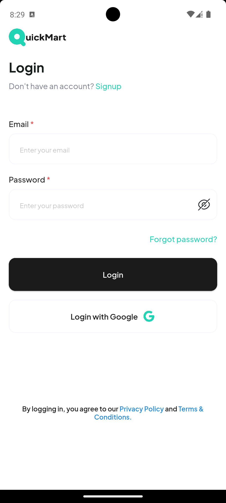
  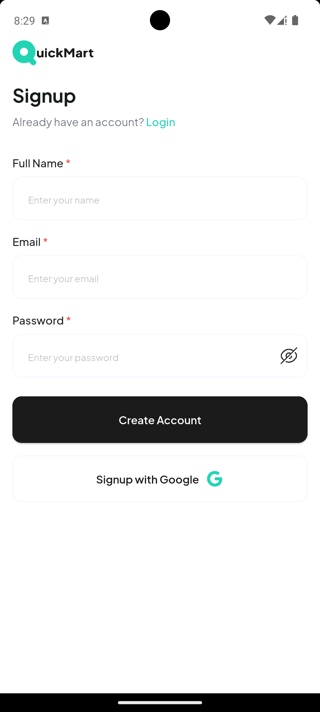
  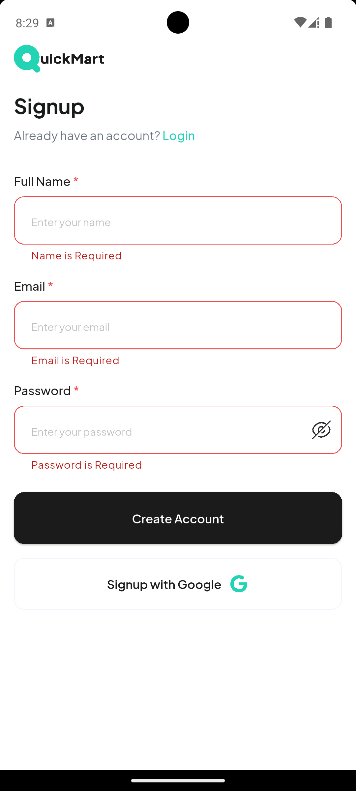
  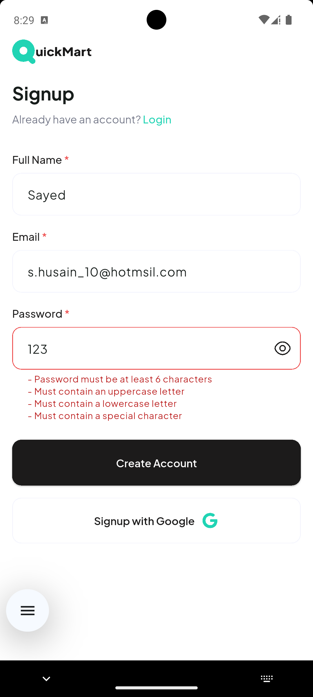
  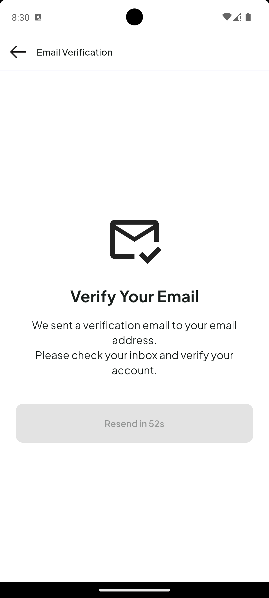

### Password Management

  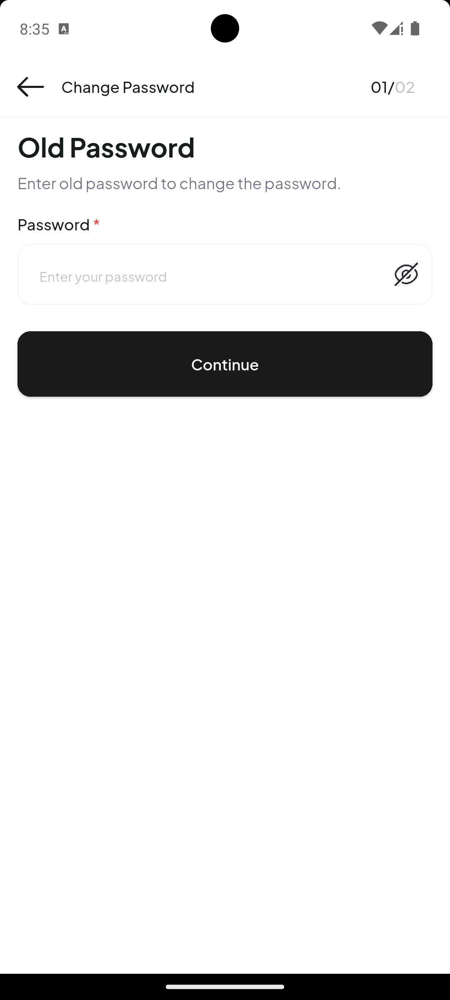
  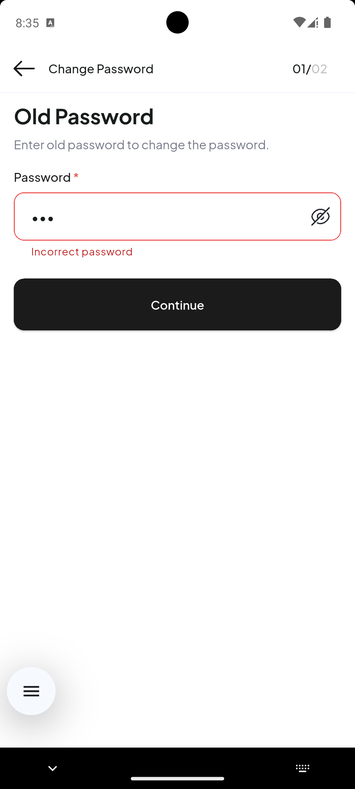
  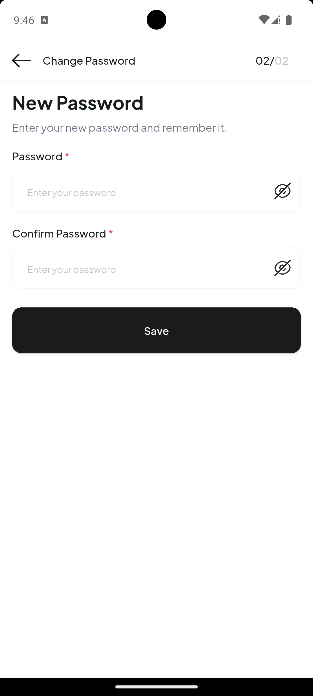

### Home & Products

  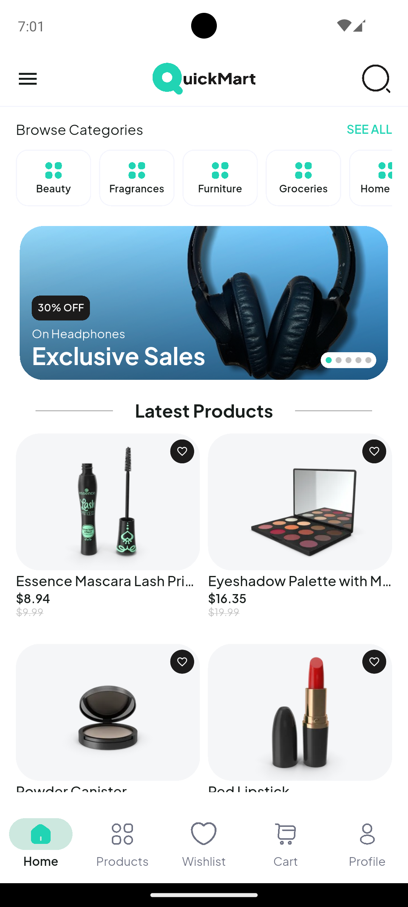
  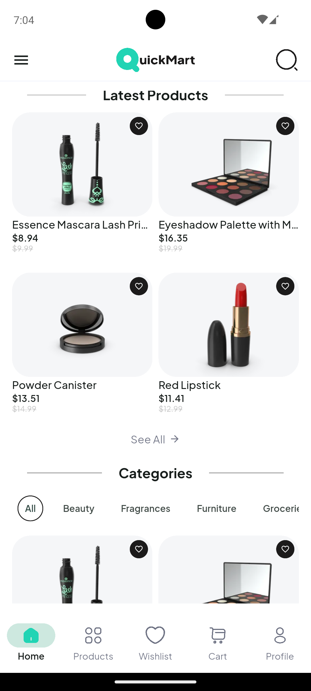
  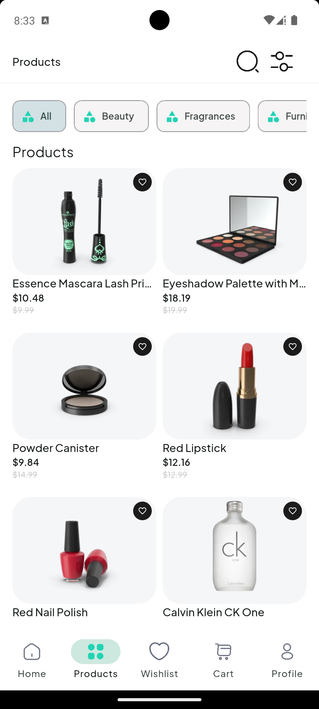
  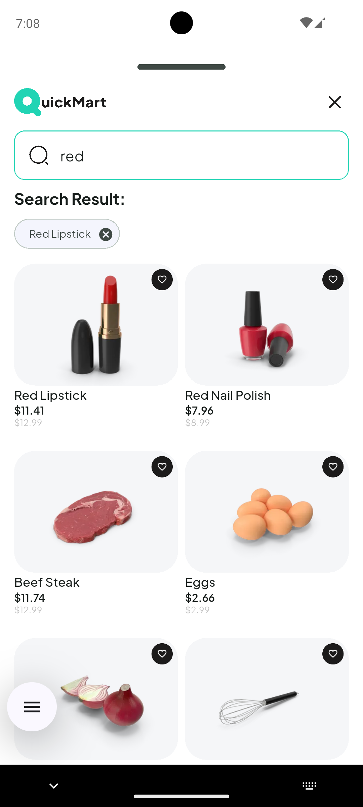

### Wishlist & Profile

  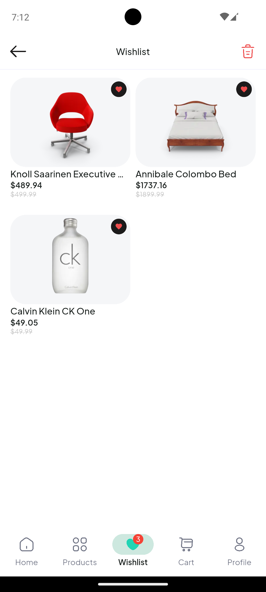
  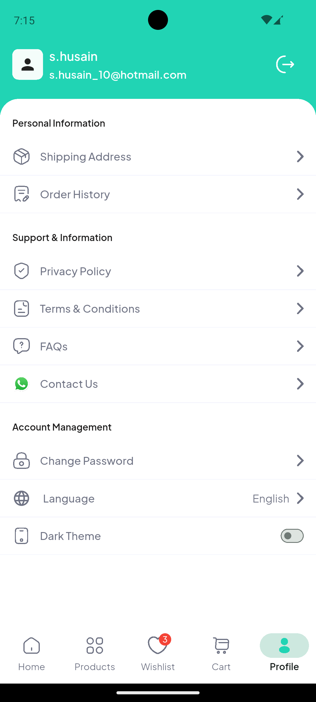

### Theming & Localization

  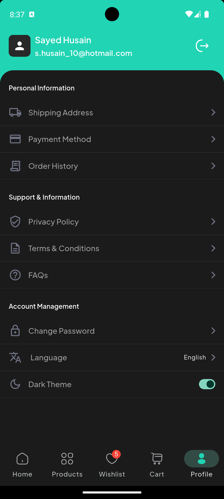
  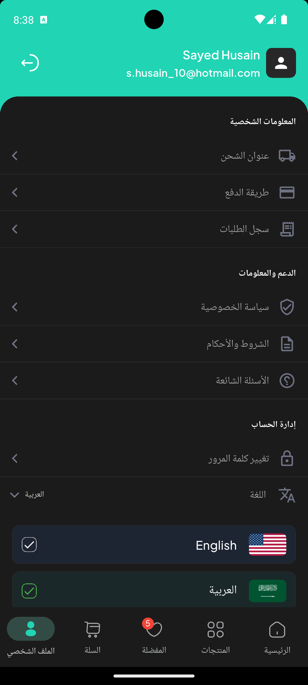

